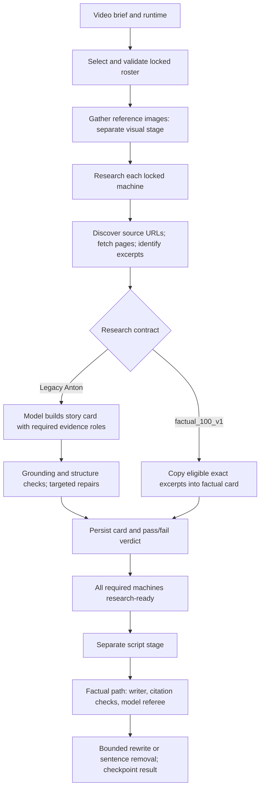

# StoryEngine DVSU research: current map and probabilistic design

Audit date: 2026-09-16. Local Git root: `/Users/ryanayler/AgentVault/Projects/story-engine`; application: `storyengine/`; branch `main`; HEAD `f92c863b550dcf5cd3a72e351d045b554ef8fdcf`. Existing dirty work preserved. This is a source-backed audit and proposed design, not an implemented change or a production accuracy evaluation. Three Terra/medium workers mapped bounded areas; Astra reviewed the evidence and owns this interpretation.

## Finding

StoryEngine has probabilistic model calls inside a mostly rule-driven research and acceptance workflow. It already gathers real pages, preserves quotations, checks identity, repairs specific gaps, and reviews script claims. What it lacks in the inspected path is a calibrated representation of uncertainty that survives research, drives the next investigation, and reaches the script writer.

Two changes are needed together: let an agent choose an evidence-seeking action from the unresolved question, and measure whether its confidence and decisions deserve trust. More sampling or higher temperature alone would increase variation without establishing either.

## Current flow

The branches matter. The newer factual card is primarily an evidence packet; its later script stage performs semantic review. The older Anton card also enforces narrative research roles. Do not apply one branch's requirements to the other or confuse image-selection scores with historical confidence. No production database was queried to identify which contract a particular current video uses.

| Stage | What code actually does | Where uncertainty is compressed |
|---|---|---|
| Discovery | Kie discovery proposes source URLs; fetched pages own evidence. Other source-gather paths and deterministic query heuristics remain. | Bounded retrieval does not estimate which important evidence is still missing. |
| Identity and provenance | Exact-machine matching, capture-method checks, source IDs, exact quotations and locators. | A valid citation establishes traceability, not truth or semantic support. |
| Factual research card | Selects up to eight eligible excerpts by default, prioritizing distinct URLs; copies text as claims. | Every copied segment is assigned `confidence: high`. |
| Legacy card | Model fills evidence roles; deterministic checks and source grounding evaluate them. Tier-floor warnings are advisory in the card gate. | Editorial completeness and historical uncertainty mostly become warning/pass states. |
| Repair | Existing cheapest-first action classifier, targeted fetch, promotion, rewrite and bounded retries. | Action priority estimates cost through rules; it does not estimate expected uncertainty reduction. |
| Factual script review | Numeric/quote guards plus model referee, alternate evidence, one targeted rewrite and possible sentence removal. | Reviewer produces pass/fail, without calibrated per-claim uncertainty or a persistent competing-hypothesis record. |
| Persistence/UI | Stores cards and validation; readiness exposes verdicts and warnings. | Readiness is permission to proceed, not a probability of factual correctness. |

Evidence anchors: `backend/factual_source_search.py:59`; `backend/factual_machine_research.py:104,156,185`; `backend/pipeline_executor.py:4206,4310,5328,12112,12789`; `backend/factual_machine_summary.py:194,333,498,613`; `backend/factual_machine_pipeline.py:29`. Full worker maps are linked below.

## Verified shortfalls and solutions

### 1. Traceability is labeled as confidence

`factual_machine_research.py:174` assigns “high” unconditionally after eligibility. The offline synthetic probe supplied two excerpts saying the same machine entered service in different years. Both received “high”; the research-card contract returned no warnings. This isolates research readiness only: the later script referee may reject the contradiction.

**Change:** separate `provenance_status`, `support_status`, `conflict_status` and `confidence_status`. Initially use `unassessed`, `supported`, `disputed`, `insufficient` and `out_of_scope`; keep numeric correctness probability null until an evaluator is calibrated. Historical claims must be atomic and scoped by machine, variant, time, event and units. Keep the original source text unchanged.

**Acceptance:** conflicting same-event dates are retained as competing claims and visibly marked disputed; commissioning versus launch dates are not falsely treated as a contradiction. Traceable text can never acquire a measured-confidence label solely because it was fetched.

### 2. Distinct sources are only approximate independence

The factual card prefers distinct URLs. For certain record/count claims, `factual_machine_summary.py:273–296` allows an authoritative tier-1/2 citation or two distinct hostnames. Different sites may repeat the same original account; a prestigious source may describe the wrong variant. The model referee provides a further semantic check, so this is a limitation of the corroboration proxy, not proof of automatic false approval.

**Change:** represent evidence lineage: original publication, author/institution, quoted references, mirrored passages, publication date, and source family. Count independent origins, not pages. Record uncertain lineage explicitly. Treat source tier as one feature of reliability, not a truth probability or universal substitute for corroboration.

**Acceptance:** five mirrors of one account contribute one evidence family; two truly independent accounts remain separate. Source disagreement is preserved. Unknown lineage is not assumed independent.

### 3. Research actions are adaptive, but the choice is mostly a fixed ladder

`_classify_repair_actions` and `repair_machine_auto` already support targeted, cheap-first repairs with budgets and duplicate-action protection. The gap is not absence of agency; it is absence of a claim-level decision state and an estimate of which action can change the conclusion.

**Change:** place a bounded research planner over the existing action tools. For each unresolved claim it proposes alternative explanations and chooses among: inspect existing evidence, find an original source, seek disconfirmation, resolve identity/date scope, qualify a claim, omit an optional claim, or ask for review. Save the question, chosen action, expected benefit, actual evidence change, cost and stop reason. Cheap deterministic fixes remain automatic.

Use expected reduction in decision loss minus research cost as the eventual objective. Until sufficient labeled outcomes exist, describe the ranking honestly as an agent heuristic with reasons. Do not invent Bayesian likelihoods or multiply correlated source votes. Exploration, if tested, stays inside safe research choices under an explicit cap; factual acceptance is never randomly sampled.

**Acceptance:** a copied-source conflict triggers an original-source search; a missing milestone triggers a scoped query; a malformed citation triggers local repair. No repeated action on unchanged evidence. Stop at budget/time limits with unresolved status, not manufactured certainty.

### 4. A second model role is not statistically independent evidence

The factual writer and referee use the same configured model family by default (`factual_machine_summary.py:571,655`), with different prompts and temperatures. The reviewer is a valuable separate evaluation step, but may share the writer's blind spots. Its alternate-context selector ranks overlap and retains at most eight excerpts; contradictory evidence can fall outside that window.

**Change:** evaluate atomic claims as supported, contradicted or not established, with evidence pointers and competing interpretations. Add a distinct adversarial review only for high-impact or disputed claims. Different model/provider families may diversify errors, but their votes still require measurement; a 2/3 vote is not a 67% truth probability. Rank alternate evidence for contradiction and scope relevance, not only shared tokens.

**Acceptance:** an unsupported but fluent claim fails even when repeated; critical contradictory evidence remains visible in the review packet; correlated review agreement is not labeled independent corroboration. Keep quote/identity/numeric guards.

### 5. No calibrated factual-confidence loop was found in the mapped path

Confidence strings, model temperature, source tiers and pass/fail tests do not show how often the system is right. Existing regression tests demonstrate useful mechanical behavior; they are not an independently labeled historical accuracy benchmark. Channel performance learning is a different signal: clicks and retention must not train factual truth labels.

**Change:** build a versioned evaluation set of real saved claims and evidence, adjudicated against original sources. Separate training/calibration and held-out test groups by machine/topic and source family. Fit a modest calibration model only if the data supports it; expose “not calibrated” otherwise. Measure Brier score and log loss, reliability plots, error among accepted claims, coverage/abstention, contradiction recall, cost, and latency. Report uncertainty intervals and results by contract and claim type.

Calibration means estimated probabilities track observed correctness; it is not produced by asking an LLM for a number. [Guo et al., ICML 2017](https://proceedings.mlr.press/v70/guo17a.html) provides the methodological grounding, not proof that any method will transfer to DVSU.

Semantic disagreement across sampled answers can be an additional uncertainty signal, especially for ambiguous claims; consistent repetition can still be wrong. [Farquhar et al., Nature 2024](https://www.nature.com/articles/s41586-024-07421-0) studies semantic entropy for detecting confabulations. Applying it here is a proposed experiment with extra inference cost, not a replacement for source evidence.

### 6. Uncertainty should survive into writing and be understandable in the UI

The stored readiness shape is primarily `passed` and `warnings`. The factual script path correctly binds approval to source fingerprint, subject, scene and review version. Preserve that protection and extend it to assessment version and evidence lineage.

**Change:** show “sources captured,” “claim disputed,” and “ready to script” as separate facts. Each disputed claim shows the evidence on both sides and the next useful action. The writer receives allowed wording and scope, unresolved claims, and omitted optional claims. Recheck when evidence or assessment version changes. Mandatory unsupported claims require review; optional disputed claims may be omitted or accurately attributed. The script stage retains its independent checks but is no longer the first place research contradictions become visible.

**Acceptance:** ambiguity cannot disappear merely by flattening the card into prose. A later correction invalidates affected claim approval without rerunning unrelated machines. Changing evidence invalidates cached review; the locked roster remains unchanged.

## Proposed delivery sequence

These are design recommendations, not authorization to implement, run providers or deploy.

1. **Build — claim assessment ledger and shadow conflict audit.** Add a small `research_claim_assessment` module and versioned assessment data beside existing source packages; hook into both research contracts after source capture and before readiness display. Add scoped UI labels. Start with provenance/support/conflict states and null numerical probability. Preserve current acceptance behavior in shadow mode. Test the six cases below. Output: per-claim audit plus current/proposed decision comparison.
2. **Build — bounded adaptive investigator.** Reuse existing repair tools behind a planner whose inputs are the ledger, current evidence, constraints and remaining budget. Implement append-only action receipts and stop rules. Run on archived source snapshots first; later provider trials need an explicit spend cap. Output: evidence gained per action, errors corrected, cost and stopping behavior.
3. **Operate — calibrated evaluation and controlled rollout.** Adjudicate a pilot set of about 100–200 claims from several videos, including both contracts and difficult cases. This is a feasibility dataset, not proof of a 99% guarantee. Keep a separate untouched grouped holdout; expand it before enforcing numeric thresholds. Compare current policy, explicit uncertainty states, and adaptive investigation at matched cost. Choose thresholds from observed accepted-error/coverage tradeoffs and editorial risk; do not hardcode an arbitrary 90% gate.
4. **Market — editor usability check.** Audience: DVSU's historical-documentary editor and channel owner. Hypothesis: visible evidence conflicts and targeted next actions reduce correction time without degrading narrative usefulness. Distribution path: the existing private StoryEngine Research workflow. Next real-world test: blinded review of a small current-versus-proposed card set, recording missed errors, unnecessary holds, review time and editorial preference. No outreach or publication performed.

Initial regression/evaluation cases: conflicting dates for one event; different milestones that can coexist; copied accounts on distinct hosts; wrong variant sharing a name; unsupported record claim; ordinary claim supported by one traceable source but not yet adjudicated. Add prompt-injection source text and citation mutation to ensure the existing safety/provenance rules remain intact.

**First recommendation:** implement the claim assessment ledger and a shadow audit of existing saved cards. This makes uncertainty observable, supplies evaluation data, and creates the state an adaptive research agent needs. Starting with randomized search, more judges, or numerical confidence would add cost before establishing trustworthy feedback.

## Evidence and limits

- [Discovery map](discovery.md), [judgment map](judgment.md), [persistence and consumption map](consumption.md).
- [Astra-reviewed execution plan](plan.json), [synthetic conflict probe](conflicting-excerpts-probe.json).
- Workers inspected source and representative tests; they did not run provider calls or claim the full regression suite passed. Astra executed only the isolated offline conflict probe and checked core source findings.
- Static analysis cannot determine actual error frequency, current provider behavior, which contract a live video uses, or whether the proposed design improves outcomes. Those are explicit goals of the shadow benchmark.
- Research remains a source-grounded card phase. Script previews and rendered output are not research evidence.
